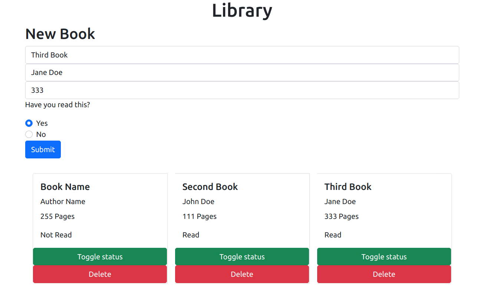

# MyLibrary

This is a mini-project that allows you to

- Add new books to the Library
- Display the books in the library
- Toggle the read status of a book
- Delete an existing book

### Live Demo

[Live Demo Link](https://newhorizon-tech.github.io/library/)

## Built With

- HTML/CSS
- Javascript
- Atom
- VS Code

## Getting Started

- Clone the repository
- Navigate to the root directory of the project
- Open index.html or run it using your own live server

## Authors

👤 **Alaukik**

- Github: [@newhorizon-tech](https://github.com/newhorizon-tech)
- Twitter: [@techintosh3](https://twitter.com/techintosh3)

👤 **Zerradi Amine**

- Github: [@dasileker](https://github.com/Stricks1)
- E-mail: [Zerradi Amine](e-mail:zerradi.amine@hotmail.com)
- Linkedin: [Zerradi amine](https://www.linkedin.com/in/amine-zerradi-46b0a697/)
- Twitter: [@dasileker](https://twitter.com/@dasileker)

## Acknowledgements

- The Odin project
- MDN Web Docs

## 🤝 Contributing

Contributions, issues, and feature requests are welcome!

Feel free to check the [issues page](https://github.com/newhorizon-tech/library/issues).

## Show your support

Give a ⭐️ if you like this project!
